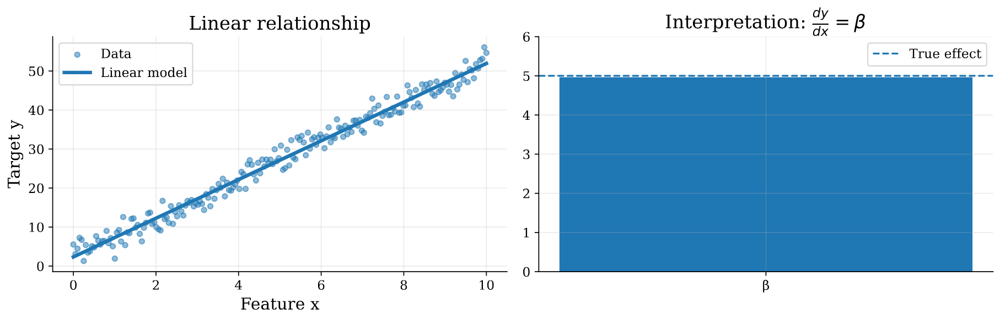
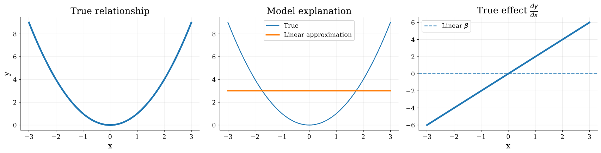
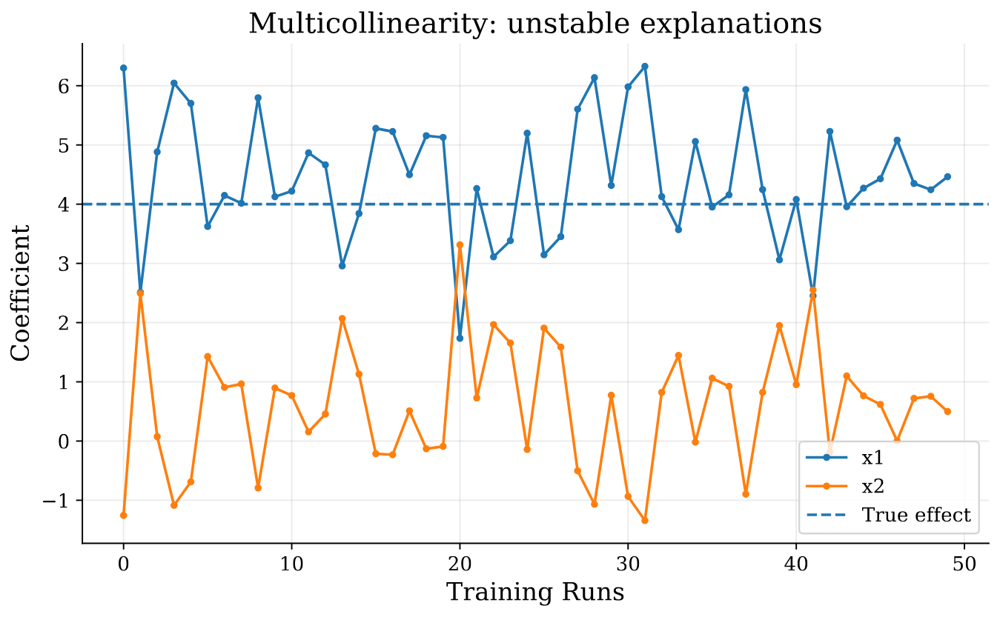

# Categorization of XML Methods

There are many taxonomies in which interpretability methods can be categorized, they can be categorized according to the nature of the learning algorithm or the stage at which the model becomes interpretable into Intrinsic and Post-Hoc methods, They can also be categorized into Local and Global methods according to the scope of explanations.

## Intrinsic vs. Post-Hoc Methods

Intrinsic methods indicate that the model itself is inherently interpretable by design the algorithm itself tends to be less complex and the factors affecting the decision making process are always disentangled [@molnar2025]. Linear Regression, Logistic Regression, Generalized linear models (GLMs) [@wang2025tutorialregressionanalysislinear] and Decision Trees are examples of models that are interpretable by design, they either show the importance of each feature, or come up with human readable decision rules [@MILLER20191;@molnar2025]. While those models are extremely simple, efficient and interpretable they face many limitations when deployed to the real world, For example linear models can be interpreted by measuring the feature importance; by looking into the coefficient of each feature in the weight matrix [@molnar2025]. However, they are built on very strict assumptions and inductive biases such as linearity, independence, and absence of heteroscedasticity which are difficult to gurantee in the real world [@Hastie+al:2009], this limits the ability of such algorithms to capture true, non-linear patterns underlying the data or even model complex high dimensional data which limits the predictive performance of such models. 

While linear models fail to model non-linear data, tree-based models come into play. They work by splitting the data multiple times according to discovered thresholds over the values of the features [@molnar2025]. Each learning algorithm uses a different criterion to grow the optimal tree. For example, ID3 measures the Information Gain criterion to find the best splits [@Quinlan1986ID3], While CART optimizes for the Gini Impurity  [@breiman1984cart]. All tree based algorithms are capable of modeling non-linear data. Those models are Interpretable intrinsically; you can traverse the tree starting from the root to the leaf in order to find the decision in the form of sequential If-Else statements. However, due to the greedy nature of the learning algorithm it tends to increase the depth of the tree drastically leading to a trade-off between error minimization and being easily interpretable [@molnar2025].

On the other hand, Post-Hoc methods work by reporting how an already trained model produces its predictions, For any given input it tries to provide understandable explanations for the learned decision boundaries by the more complex black-box models [@arrieta2019explainableartificialintelligencexai,@molnar2025]. Post-Hoc methods can be categorized into two main categories: Model-Agnostic methods, and model model-specific methods [@arrieta2019explainableartificialintelligencexai], Where the former can be plugged into any model to explain its decision space, e.g perturbation based approaches like LIME [@ribeiro2016whyitrustyou] and SHAP [@lundberg2017unifiedapproachinterpretingmodel] that predict how the decision space changes when the input data point is perturbed, While the latter is specific to a model architecture like analyzing attention maps in transformer networks, or gradient-based methods that look into the gradient of the input with respect to the loss function to provide pixel-level explanations like Saliency Maps [@simonyan2014deepinsideconvolutionalnetworks], class activation maps (CAM) [@minh2023overviewclassactivationmaps] and it varients like GradCAMs [@Selvaraju_2019] in convolutional neural networks (CNNs) are also used to quantify the amount of input activation conditioned on the output class to provide a heat-map for the relevant regions for the predicted class.

### Linear Regression

Linear regression represents the output variable $y$ as a linear combination of the input features $\mathbf{X}$ weighted by the scaling coefficient matrix $\boldsymbol{\beta}$.
Mathematically:$$\mathbf{y} = \mathbf{X}\boldsymbol{\beta} + \boldsymbol{\varepsilon},$$
$$\mathbf{X} \in \mathbb{R}^{n \times p}, \quad \mathbf{y} \in \mathbb{R}^{n}, \quad \boldsymbol{\beta} \in \mathbb{R}^{p}, \quad \boldsymbol{\varepsilon} \in \mathbb{R}^{n}.$$where $\boldsymbol{\varepsilon}$ is called the irreducible error term, it is typically considered a random variable with zero mean and constant variance. It captures the noise, and the variations in the data that the model failed to explain using the given features, $n$ is the number of training instances, and $p$ is the number of features.

We can run iterative optimization using standard gradient descent algorithm [@ruder2017overviewgradientdescentoptimization] to find the betas that minimize mean squared error (MSE):$$J(\boldsymbol{\beta}) = \frac{1}{2n} \left\Vert{} \mathbf{y} - \mathbf{X}\boldsymbol{\beta} \right\Vert{}_2^2.$$
$$\boldsymbol{\beta}^{(t+1)} = \boldsymbol{\beta}^{(t)} - \eta \frac{1}{n} \mathbf{X}^{\top} (\mathbf{X}\boldsymbol{\beta}^{(t)}-\mathbf{y}),$$
$$\frac{\partial y}{\partial x_j} = \boldsymbol{\beta}_j,$$

Linear Regression models are inherently interpretable through their coefficient vector $\boldsymbol{\beta}$. Each coefficient $\beta_j$ quantifies the effect of the corresponding feature represented by the $j$-th column of the feature matrix $\mathbf{X}$ as shown in @fig-linear-interpretability.

{#fig-linear-interpretability width=85%}

While Linear Regression is simple, and interpretable by design, many limitations rise from the implicit inductive biases assumed by this model [@wang2025tutorialregressionanalysislinear]. First, Linear Regression models assumes a linear relationship between the input features and the target variable if the relation is not linear the learned coefficient fails to explain the effect of the feature as shown in @fig-nonlinear-interpretability, more formally:
$$\frac{\partial y}{\partial x_j} \neq \boldsymbol{\beta}_j,$$

{#fig-nonlinear-interpretability width=85%}

Also, Linear Regression models assumes independence between features. Feature correlation can be reflected in the Gram matrix $\mathbf{X}^{\top}\mathbf{X}$, where off-diagonal elements quantify the similarity between feature columns. Strong correlations between features introduce multicollinearity, making the estimated coefficients $\boldsymbol{\beta}$ unstable and reduces interpretability as shown in @fig-multicollinearity.

{#fig-multicollinearity width=85%}

### Logistic Regression

### Decision Trees

### K-Nearest Neighbors

## Global vs. Local Explainability

##  Model-Agnostic vs. Model-Specific
