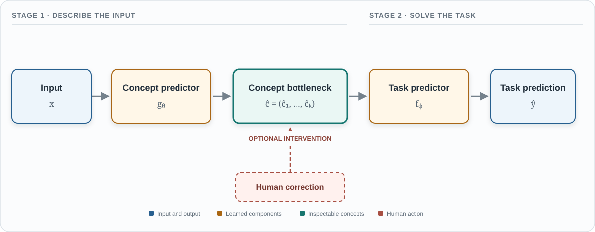

# Method A: Concept Bottleneck Models

Concept Bottleneck Model are a supervised concept-based method which require human-defined concept vocabulary. The broader idea and need of [concept-based explainability](introduction.qmd#concept-based-explainability), including the definition of a concept and the notation used here, is introduced in the introduction.

::: {.callout-note title="Running example: restaurant recommendation"}
Throughout this section, consider a CBM that predicts whether a customer will recommend a restaurant.

The input is a written restaurant review. The model uses three concepts:

| Concept | Meaning |
|---|---|
| Food quality | 0 means poor and 1 means excellent |
| Service speed | 0 means slow and 1 means fast |
| Intention to return | 0 means no and 1 means yes |

For the review *“The pasta was excellent, but we waited an hour and will not return,”* the concept predictor should assign a high score to food quality and low scores to service speed and intention to return. The task predictor then uses these concept scores to predict whether the customer recommends the restaurant.
:::


## Architecture and inference

A [Concept Bottleneck Model (CBM)](https://proceedings.mlr.press/v119/koh20a.html) makes prediction in two stages:

$$
x
\xrightarrow{\;g_\theta\;}
\widehat{\mathbf{c}}
\xrightarrow{\;f_\phi\;}
\widehat{y}.
$$ {#eq-cbm-pipeline}

The concept predictor $g_\theta$ maps the input $x$ to predicted values for a set of human-defined concepts. The task predictor $f_\phi$ then uses the predicted concept vector to produce the task output:

$$
\widehat{y}
=
h_{\theta,\phi}(x)
=
f_\phi\!\left(g_\theta(x)\right).
$$ {#eq-cbm-model}

In the running example, $x$ is the restaurant review. The concept predictor maps the review to predicted values for food quality, service speed, and intention to return. The task predictor then uses these three values to predict whether the customer will recommend the restaurant.

The concept vector is called a *bottleneck* because the task prediction is made only from the predicted concept values. In a strict CBM, there is no separate path that passes information directly from $x$ to $\widehat{y}$. Some CBM variants pass additional features to the task predictor, which relaxes this strict bottleneck.


::: {.content-visible when-format="html"}

```{=html}
<figure style="margin: 1.5rem 0 2rem; text-align: center;">
  <object
    data="../figures/xlm/cbm-architecture.svg"
    type="image/svg+xml"
    style="display: block; width: 100%; max-width: 1200px; margin: 0 auto;"
    aria-label="Interactive diagram of a Concept Bottleneck Model">
    
  </object>
  <figcaption style="margin-top: 0.6rem; color: #64717d; font-size: 0.85rem;">
    Inference and optional concept correction in a strict Concept Bottleneck Model.
  </figcaption>
</figure>
```

:::

::: {.content-visible unless-format="html"}

{#fig-cbm-architecture width=100%}

:::


### Concept predictor and concept values

The concept predictor $g_\theta$ maps the original input to the predicted concept vector $\widehat{\mathbf{c}}$. Its architecture depends on the type of input. It may use a convolutional network for images or a transformer for text. In the running example, a transformer processes the restaurant review and predicts values for food quality, service speed, and intention to return.

Let $k$ be the number of concepts. The predicted concept vector is

$$
\widehat{\mathbf{c}}
=
(\widehat{c}_1,\ldots,\widehat{c}_k),
$$

where $\widehat{c}_j$ denotes the predicted value of concept $j$. Each concept has a predefined meaning, but its numerical representation depends on the type of concept.


| Concept type | Example | Common representation |
|---|---|---|
| Binary | Intends to return | A value in $\{0,1\}$, a probability in $[0,1]$, or a logit |
| Categorical | Type of restaurant | One value for each category |
| Ordinal | Service rating | An ordered value such as 1, 2, 3, 4, or 5 |
| Continuous | Waiting time | A real-valued measurement |

A binary concept can be represented as a hard value, where 0 means absent and 1 means present. It can also be represented by a probability. For example,

$$
\widehat{c}_{\mathrm{return}}=0.08
$$

indicates that the model assigns a low probability to the concept *intends to return*.

Before applying the sigmoid function, a binary concept predictor may produce a concept logit $\ell_j^{\mathrm{concept}}\in\mathbb{R}$. The corresponding probability is

$$
\widehat{c}_j
=
\sigma\!\left(\ell_j^{\mathrm{concept}}\right)
=
\frac{1}{1+e^{-\ell_j^{\mathrm{concept}}}}.
$$ {#eq-cbm-binary-concept}

A categorical concept with $M$ possible categories is usually represented by $M$ logits or probabilities. Softmax converts the logits into probabilities that sum to 1:

$$
\widehat{c}_{jm}
=
\frac{\exp\!\left(\ell_{jm}^{\mathrm{concept}}\right)}
{\displaystyle\sum_{q=1}^{M}\exp\!\left(\ell_{jq}^{\mathrm{concept}}\right)},
\qquad m=1,\ldots,M.
$$ {#eq-cbm-categorical-concept}

Continuous concepts can be represented directly using a real-valued prediction. They are often normalized when concepts use very different numerical ranges.

Soft concept values preserve more information than hard values. For example, probabilities of 0.51 and 0.99 both become 1 after thresholding, even though the model treats them differently. However, a predicted probability should only be interpreted as reliable confidence when the concept predictor has been calibrated.


### Task predictor

The task predictor $f_\phi$ receives only the predicted concept vector rather than the original input, so it is usually smaller than the concept predictor. The form of $f_\phi$ determines how the concepts are combined to produce the final prediction. Two common choices are a linear task predictor, which combines concepts using learned weights, and a nonlinear task predictor, which can also model interactions between concepts. We use $\ell^{\mathrm{concept}}$ for logits produced by the concept predictor and $\ell^{\mathrm{task}}$ for logits produced by the task predictor.


### Linear task predictor

Suppose the task has $R$ classes. A linear task predictor calculates one *logit* for each class:

$$
\boldsymbol{\ell}^{\mathrm{task}}
=
W\widehat{\mathbf{c}}+\mathbf{b},
$$ {#eq-cbm-general-linear-head}

or, for class $r$,

$$
\ell_r^{\mathrm{task}}(\widehat{\mathbf{c}})
=
b_r+\sum_{j=1}^{k}w_{rj}\widehat{c}_j.
$$ {#eq-cbm-linear-class-logit}

A logit is an unnormalized real-valued prediction. For a multiclass task, the logits are converted into class probabilities using the softmax function:

$$
p(y=r\mid\widehat{\mathbf{c}})
=
\frac{\exp\!\left(\ell_r^{\mathrm{task}}\right)}
{\displaystyle\sum_{q=1}^{R}\exp\!\left(\ell_q^{\mathrm{task}}\right)}.
$$ {#eq-cbm-softmax}

The restaurant example is a binary task. Let $y=1$ mean *recommend* and $y=0$ mean *do not recommend*. The task predictor can calculate the recommendation logit as

$$
\ell_{\mathrm{rec}}^{\mathrm{task}}(\widehat{\mathbf{c}})
=
b
+w_{\mathrm{food}}\widehat{c}_{\mathrm{food}}
+w_{\mathrm{speed}}\widehat{c}_{\mathrm{speed}}
+w_{\mathrm{return}}\widehat{c}_{\mathrm{return}}.
$$ {#eq-cbm-restaurant-linear-head}

The logit is converted into a recommendation probability using the sigmoid function:

$$
p(y=1\mid\widehat{\mathbf{c}})
=
\sigma\!\left(\ell_{\mathrm{rec}}^{\mathrm{task}}(\widehat{\mathbf{c}})\right),
\qquad
\sigma(u)=\frac{1}{1+e^{-u}}.
$$ {#eq-cbm-restaurant-probability}

Each weight describes how the corresponding concept changes the model's logit while the other concepts remain fixed. For example, a positive value of $w_{\mathrm{speed}}$ means that a higher service-speed value increases the recommendation probability.

Weight magnitudes can be compared directly only when the concepts use comparable scales. In the running example, all three concepts range from 0 to 1, so this comparison is reasonable.

These weights describe the model's calculation. They do not establish cause and effect in the real world. A positive value of $w_{\mathrm{speed}}$ shows that the model associates faster service with a higher recommendation probability. It does not prove that changing the restaurant's service speed would cause the customer to recommend it.

### Nonlinear task predictor

A nonlinear task predictor allows the prediction to depend on more complex relationships between concepts. A common choice is a multilayer perceptron:

$$
\boldsymbol{\ell}^{\mathrm{task}}
=
f_\phi(\widehat{\mathbf{c}})
=
W_2
\rho\!\left(
W_1\widehat{\mathbf{c}}+\mathbf{b}_1
\right)
+\mathbf{b}_2,
$$ {#eq-cbm-general-nonlinear-head}

where $\rho$ is a nonlinear activation function, such as ReLU or GELU. The resulting logits can be converted into probabilities using softmax for a multiclass task or sigmoid for a binary task.

For the restaurant example, a simple nonlinear predictor can include an interaction between food quality and service speed:

$$
\ell_{\mathrm{rec}}^{\mathrm{task}}(\widehat{\mathbf{c}})
=
b
+w_{\mathrm{food}}\widehat{c}_{\mathrm{food}}
+w_{\mathrm{speed}}\widehat{c}_{\mathrm{speed}}
+w_{\mathrm{return}}\widehat{c}_{\mathrm{return}}
+w_{\mathrm{food,speed}}
 \widehat{c}_{\mathrm{food}}
 \widehat{c}_{\mathrm{speed}}.
$$ {#eq-cbm-restaurant-nonlinear-head}

The recommendation probability is

$$
p(y=1\mid\widehat{\mathbf{c}})
=
\sigma\!\left(\ell_{\mathrm{rec}}^{\mathrm{task}}(\widehat{\mathbf{c}})\right).
$$

The interaction term allows the contribution of food quality to depend on service speed. For example, good food may provide stronger support for a recommendation when service is fast.

With interactions, the contribution of one concept depends on the values of other concepts. This can capture relationships between concepts, but it becomes harder to isolate the contribution of each concept using a single weight.


## What does a CBM explain?

A CBM provides a concept-level account of the final prediction. For one input, a reader can inspect:

1. **The model's description of the input:** which concepts were predicted and their predicted scores. A score represents confidence only when it is calibrated.
2. **The task decision:** which concepts supported or opposed the predicted class. This is easiest to see with a linear task predictor.
3. **The sensitivity to corrections:** whether the task prediction changes when an incorrect concept is replaced with a corrected value.

Across a dataset, the weights of a linear task predictor show which concepts are generally associated with each class. Concept accuracy can also be examined separately for each concept to find systematic errors.

The bottleneck does not make the whole system transparent. The concept predictor $g_\theta$ may still be a complex neural network, so the CBM does not automatically explain *why* the input produced a particular concept score. It makes the second step, from concepts to the task prediction, easier to inspect.

For the running review, a predictor concept vector, \(\widehat{\mathbf c}=(0.94,0.08,0.05).\) suggest that model detected amazing food, slow service and no intention to return for the particular review. The task predictor combines these score to predict the recommendation. This lets a reader inspect how model percieve the review in human defined vocabulary and how it those different percieved concepts were weighted.

## Training regimes

Suppose the training data contain triples $(x_i,\mathbf{c}_i,y_i)$. CBMs are commonly trained in one of three ways:

1. **Independent training:** train $g_\theta$ to predict the annotated concepts, and separately train $f_\phi$ using the annotated concepts as input. The task predictor therefore learns from clean annotations but receives predicted concepts at inference time. See [Koh et al. (2020), *Concept Bottleneck Models*](https://proceedings.mlr.press/v119/koh20a/koh20a.pdf).

2. **Sequential training:** first train $g_\theta$, freeze it, and then train $f_\phi$ on $g_\theta(x_i)$. The task predictor sees the kinds of concept errors it will encounter at inference time. See [Koh et al. (2020), *Concept Bottleneck Models*](https://proceedings.mlr.press/v119/koh20a/koh20a.pdf).

3. **Joint training:** train both components together using a concept loss and a task loss. The task loss is backpropagated through both $f_\phi$ and $g_\theta$, while the concept loss keeps the bottleneck tied to the annotated concepts. See [Koh et al. (2020), *Concept Bottleneck Models*](https://proceedings.mlr.press/v119/koh20a/koh20a.pdf).

   A typical joint objective is

   $$
   \mathcal{L}
   =\lambda\,\mathcal{L}_{\text{concept}}
     \left(g_\theta(x_i),\mathbf{c}_i\right)
   +\mathcal{L}_{\text{task}}
     \left(f_\phi(g_\theta(x_i)),y_i\right),
   $$ {#eq-cbm-joint-loss}

   where $\lambda$ controls the importance of accurate concept prediction. Joint training can improve task performance, but it is still necessary to evaluate whether the predicted concepts match their intended meanings.

   [Sheth and Kahou (2023), *Auxiliary Losses for Learning Generalizable Concept-based Models*](https://arxiv.org/pdf/2311.11108), extend joint training with **cooperative-CBM (coop-CBM)**. Their method adds an auxiliary head that predicts the task label from the representation shared with the concept predictor. Its objective combines the concept loss, an auxiliary task loss, the final task loss, and a concept orthogonal loss. The orthogonal loss encourages within-concept similarity and separation between different concept representations. The auxiliary head helps shape the shared representation during training, while the final task predictor still receives only the predicted concepts. The paper evaluates the approach on image-classification datasets, including settings with distribution shift.

The concept loss must match the concept type. Binary concepts commonly use binary cross-entropy, categorical concepts use cross-entropy, and continuous concepts use a regression loss. If only some concepts are annotated for an example, the concept loss can be calculated over the available annotations.

## Concept interventions

At inference time, a person can inspect $\widehat{\mathbf{c}}$ and correct concepts that are clearly wrong. If $S$ is the set of corrected concepts, define

$$
\widetilde{c}_j=
\begin{cases}
c_j^{\text{edit}}, & j\in S,\\
\widehat{c}_j, & j\notin S.
\end{cases}
$$ {#eq-concept-intervention}

The revised prediction is $\widetilde{y}=f_\phi(\widetilde{\mathbf{c}})$. This supports questions such as: *Would the prediction change if the concept “contains a negation” were corrected from absent to present?*

An intervention explains the behavior of the model under a concept edit. It does not prove that changing the corresponding property in the real world would cause the same outcome. Edits can also create unlikely combinations of concepts, so their results should be interpreted carefully.

## Evaluating a CBM

Task accuracy alone is not enough. A useful evaluation should check four parts of the model:

- **Task performance:** how accurately $\widehat{y}$ predicts the task label.
- **Concept performance:** how accurately each $\widehat{c}_j$ predicts its annotated concept. Per-concept results are important because an average can hide a poorly learned concept.
- **Concept-set sufficiency:** how well the task can be predicted from the annotated concepts. Poor performance may indicate that the vocabulary is missing useful information, but it can also result from noisy concept annotations or an unsuitable task predictor.
- **Intervention performance:** how the task performance changes as incorrect concept predictions are corrected. This tests whether better concepts lead to better task predictions.

These measurements answer different questions. A CBM may predict the task well while predicting some concepts poorly. It may also predict every annotated concept well but perform poorly because the concept set is incomplete or the task predictor is unsuitable.

## Limitations and appropriate use cases

CBMs are most useful when a task has a stable concept vocabulary, reliable concept annotations are available, and a person can meaningfully inspect or correct the concepts. They are particularly suitable when concept-level feedback is more practical than changing the original input.

Their main limitations are:

- **Incomplete vocabulary:** if important information is missing from the concept set, a strict CBM may lose predictive accuracy.
- **Annotation cost and noise:** concept labels can be expensive to collect and may differ across annotators.
- **Concept prediction errors:** an understandable concept is not useful when the model predicts it unreliably.
- **Hidden shortcuts:** the concept predictor may use an unintended input pattern to predict the correct concept value.
- **Information in soft scores:** small variations in continuous concept scores can carry information beyond the concepts' stated meanings. This can weaken interpretability and concept interventions, as discussed by [Havasi et al. (2022)](https://openreview.net/forum?id=tglniD_fn9).
- **Limited transparency with complex heads:** a nonlinear $f_\phi$ may make the relationship between concepts and predictions difficult to follow.

Architectures with residual features or a direct path from $x$ to $\widehat{y}$ may recover some accuracy. However, because named concepts no longer carry all the information used for the prediction, they do not provide the same explanation guarantee as a strict CBM.

## Reducing the need for concept annotations

Recent extensions reduce the amount of per-example concept labeling. [Label-free CBMs](https://arxiv.org/abs/2304.06129) use a chosen list of concept names together with pretrained representations to construct a concept bottleneck without manually labeling every training example. [Post-hoc CBMs](https://arxiv.org/abs/2205.15480) project a pretrained model's representations into a concept space rather than training the entire model from the beginning.

The term *label-free* refers to concept labels: these methods can still require task labels, a human-selected concept vocabulary, and pretrained models. Their concept scores must also be validated. A concept name alone does not guarantee that the score consistently measures the intended property.

::: {.callout-tip title="Key takeaway"}
A strict CBM predicts named concepts first and makes the final prediction only from those concepts. This structure makes concept inspection and correction possible. The explanation is useful only when the concept vocabulary is relevant and the predicted concept values are reliable.
:::
