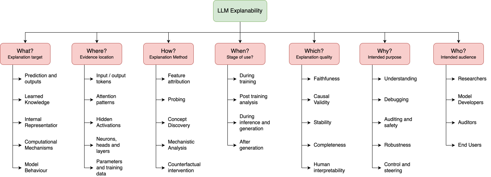

# Taxonomy

We organize LLM explainability around seven guiding questions: **What, Where, How, When, Which, Why, and Who**, as illustrated in @fig-llm-explainability-taxonomy. These questions help organize LLM explainability methods based on what they explain, how they work, and how they are used and evaluated.

::: {style="text-align: center;"}
{#fig-llm-explainability-taxonomy width=100%}
:::

## What? Explanation Target

- **Predictions and outputs:**
- **Learned knowledge:**
- **Internal representations:**
- **Computational mechanisms:**
- **Model behaviour:**

## Where? Evidence Location

- **Input and output tokens:**
- **Attention patterns:**
- **Hidden activations:**
- **Neurons, heads, and layers:**
- **Parameters and training data:**

## How? Explanation Method

- **Feature attribution:**
- **Probing:**
- **Concept discovery:**
- **Mechanistic analysis:**
- **Counterfactual intervention:**

## When? Stage of Use

- **During training:**
- **Post-training analysis:**
- **During inference and generation:**
- **After generation:**

## Which? Explanation Quality

- **Faithfulness:**
- **Causal validity:**
- **Stability:**
- **Completeness:**
- **Human interpretability:**

## Why? Intended Purpose

- **Understanding:**
- **Debugging:**
- **Auditing and safety:**
- **Robustness:**
- **Control and steering:**

## Who? Intended Audience

- **Researchers:**
- **Model developers:**
- **Auditors:**
- **End users:**
