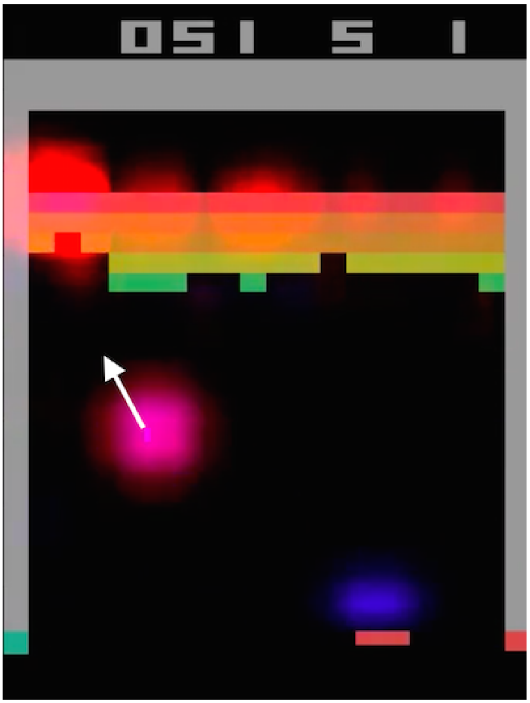

# Perturbation-Based Saliency Maps for RL

Key reference: @greydanus2018visualizing --- [paper](https://arxiv.org/abs/1711.00138) and [code](https://github.com/greydanus/visualize_atari)

::: {.callout-tip title="TL;DR"}
**Perturbation-based saliency maps** are useful to visualize the "attention" of an RL agent in a visual environment.
:::

## Introduction {.unnumbered}

::: {layout="[65, 35]" layout-valign="center"}

::: {#intro-text}
@greydanus2018visualizing use saliency maps to visualize RL policies in pixel-based environments and evalute they framework on Atari 2600 games.

In particular, they use a perturbation-based approach, witih the leading question: "How much does removing information from the region around location (i, j) change the policy?"

The saliency maps can be applied at different stages: (1) during training to understand how an agent learns and (2) after training, observing what parts of the state space the agent's final policy attends to.
:::

{#fig-xrl-m1-example width=85%}

:::

## Method: Perturbation-Based Saliency Maps {.unnumbered}

The core idea behind this method is to measure how much a neural network's output (its policy and value estimates) changes when information is selectively removed from the input image. Rather than simply blacking out a region, the method introduces **spatial uncertainty** by locally blurring the image. If the agent's proposed action or value estimate drastically changes when a specific area is blurred, that region is highly salient to the agent's decision-making process.

The perturbation applied to a localized coordinate \\((i,j)\\) on an image frame  $I_t$ is defined by the following key math:

$$\Phi(I_t,i,j)=\underbrace{I_t}_{\text{image frame}}\odot (1-\underbrace{M(i,j)}_{\text{mask}})+\underbrace{A(I_t,\sigma_A)}_{\text{blurred frame}}\odot M(i,j),$$

where $\odot$ denotes the Hadamard product and $I_{1:t}$ is a sequence of images.

This visualization technique is separate from the RL algorithm used for training. The authors used the A3C algorithm, which yields both a policy and value function. The above procedure for constructing perturbation-based saliency was applied to both the policy  $\pi$ and $V^\pi$. They use patches of 5x5 pixels to reduce the required computation.

## Tradeoffs {.unnumbered}

::: {layout-ncol="2"}

| Pros |
| :--- |
| Easy implementation |
| Generally applicable to any pixel-based state spaces |

| Cons |
| :--- |
| Requires running the model multiple times to test different image locations |
| Gives no insights into the weights; model remains black-box |

:::

## Related {.unnumbered}

- Instead of perturbation-based saliency maps, prior work has used Jacobian-based ones [@wang2016dueling; @zahavy2016graying].
