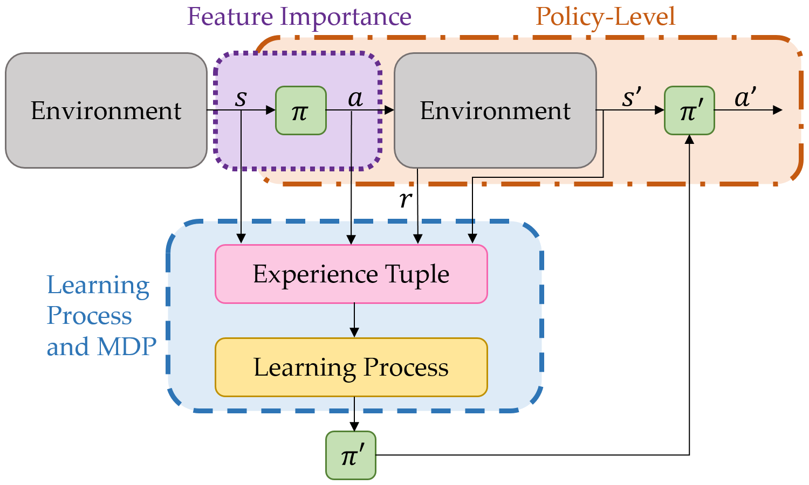

# Taxonomy

Diverse approaches exist to explain RL agents, most of which can be categorized as intrinsic vs. post-hoc, as commonly done for supervised learning. However, in this tutorial we follow the taxonomy by @milani2024explainable, because it applies directly to the unique setting of RL.

{#xrl-taxonomy width=85%}

## Feature importance (or: action level)
This approach works on low-level states, explaining what is important for finding the right actions to explain a specific state. This includes saliency maps.

- feature importance
- expected outcomess

## Learning process and MDP level (or: sequency level)
This shows the past experiences or the components of the MDP that led to the current behavior; it includes decision trees and finite state machines.

- counterfactual sequency
- important elements
- human-readable MDP

## Policy level
The vast majority (175 works, whereas sequence-level is only 11)
Aiming to explain an agent's long-term behavior, this includes reward decomposition and counterfactuals.

- constructing interpretable policies
    - surrogate model
    - inherently understandable
- summarizing policies
- human-readable MDP
    - surrogate model
    - inherently understandable
- Visual anlysis

Other taxonomies:

- Following the general XAI taxonomy, XRL methods can also be divided by scope (local vs. global) and time of extraction (intrinsic, which is always model-specific, vs. post-hoc, which can be model-specific or -agnostic). @bekkemoen2024explainable provide a useful taxonomy by further subdividing intrinsic explainability and post-hoc explainability into explanations via generation, representation, and inspection.
- Interpretable inputs can be achieved via structured approaches, extracting symbolic representations, hierarchical approaches {@glanois2024survey}
- @qing2022survey divides XRL methods into four categories: agent model-explaining, reward-explaining, state-exlaining, task-explaining.
- @dazeley2023explainable propose the causal XRL framework (CXF), a wholistic cognitive model for XAI, which uses RL as the backbone. While this presents an ambitious and inspiring perspective for future work, it is not a clear-cut taxonomy for XRL methods.

## Alternative taxonomy structure:

### Visualization-Based Approaches

State-value heatmaps can reveal an agent's strategic understanding of the environment. This is particularly useful in navigation-based settings such as mazes.

For more fine-grained explanations, we can also visualize state-action values (Q values) to identify the agent's understanding of actions from the perspective of a given state.

Visiualization-based explainability toolkits for RL have been proposed such as DQNViz [@wang2018dqnviz], developed for DQN-based agents learning Atari games.

### More stuff to sort in

Decision trees are inherently interpretable. Once a policy is learned, the reasoning behind every decision can be clearly traced by following the tree's decision nodes. This works well when individual state features are meaningful (e.g., position, velocity); however, it struggles with high-dimensional state spaces such as raw pixels

Example: VIPER @bastani2018verifiable, an approach to make RL verifiable by learning decision tree policies

\section{Representation space analysis}

Just like in supervised learning, it is of great interest to understand what kind of internal representations deep networks actually discover. High-dimensional state spaces such as pixels can be mapped to lower-level features using t-SNE.

\section{Explaining decisions through critical states}

Example: StateMask \cite{cheng2023statemask}

\section{Trajectory-based methods}

An example of behavior discovery and attribution is this: \cite{rishavbehaviour}

\section{Explainability via counterfactual reasoning}

A recent focus in the RL community is using world models for better sample-efficiency and higher performance. By having a world model learn the environment dynamics $P(s_{t+1}\mid s_t,a_t)$, we can predict future states without interaction with the real environment. This is essential for planning and also has the useful side effect that it enables counterfactual reasoning, useful for generating "what-if" scenarios.

\cite{van2018contrastive} is among the first to use world models for counterfactual explanations in RL.

\cite{singh2025explainable} uses backward counterfactuals ("What state would cause agent to do $X$?"), using a reverse world model $P(s_t\mid s_{t+1},a_t)$

\section{Evaluation of XRL methods}

Unique challenges to XRL are the sequential nature of decisions, requiring understanding of strategies rather than single model predictions, temporal dependencies making explanations more complex, and evolving agent behavior during learning.

There are three evaluation levels identified  by \cite{doshi2017towards}, which are increasingly specific and costly: functionally grounded (computational metrics only), human-grounded (general users + simplified tasks), and application-grounded (domain experts + real tasks).

\section{Applications}
